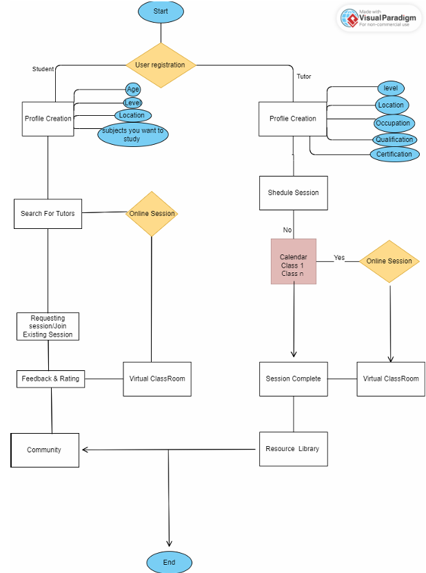

# 📚 TutorMatchup

**A hybrid mobile application connecting students with qualified, nearby tutors.**  
Built using **Flutter** with **Firebase** for backend services.

## 🔧 Tech Stack
- **Frontend**: Flutter (Dart)
- **Backend/DB**: Firebase Auth, Firestore, Firebase Storage
- **Other Tools**: Haversine formula (for nearby tutor matching)

## 🔑 Key Contributions
- Designed and developed the **complete frontend**
- Integrated **Firebase Authentication**
- Implemented data storage with **Cloud Firestore & Firebase Storage**
- UI focused on **usability** and **efficient navigation**

## 🎯 Core Features
- **Student & Tutor Signup/Login**
- **Tutor Discovery**: Find nearby tutors based on location
- **In-Person Connection**: Matches tutors and students within same city/locality
- **Ratings & Reviews**: Identify top tutors from student feedback
- **Profile Management**: Update, edit, delete accounts

## 📈 Unique Points
- One platform for both **students & tutors**
- Haversine formula to calculate **nearest tutors**
- Combines online discovery with **in-person education**
- Aligns with **SDGs** (Sustainable Development Goals)

## 📽 Demo
[Demo Video (Google Drive)](https://drive.google.com/file/d/1B_j9gicJSM5P_R5TWZ_8seStajf3zLrZ/view?usp=drive_link)

## 📊 Project Flow

---
